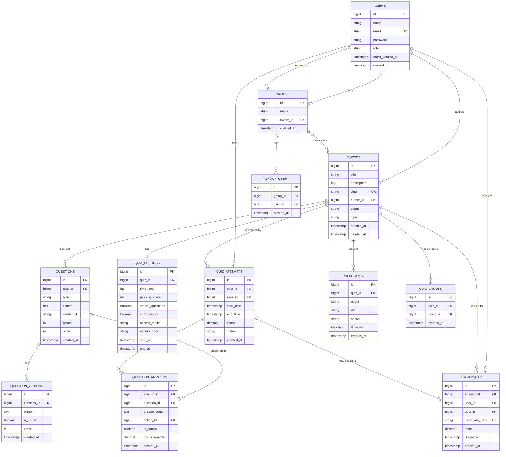

# ProptIQ Database Schema

## Entity Relationship Diagram



## Relationship Summary

### One-to-Many Relationships
- **User** → Groups (as owner)
- **User** → Quizzes (as author)
- **User** → Quiz Attempts
- **User** → Certificates
- **Quiz** → Questions
- **Quiz** → Quiz Attempts
- **Quiz** → Webhooks
- **Quiz** → Certificates
- **Question** → Question Options
- **Question** → Question Answers
- **Quiz Attempt** → Question Answers

### One-to-One Relationships
- **Quiz** ↔ Quiz Settings
- **Quiz Attempt** ↔ Certificate (optional)

### Many-to-Many Relationships
- **User** ↔ Groups (via group_user)
- **Quiz** ↔ Groups (via quiz_groups)

---

## Tables

### users
Stores user accounts with role-based access.

| Column | Type | Description |
|--------|------|-------------|
| id | BIGINT | Primary key |
| name | VARCHAR(255) | User's full name |
| email | VARCHAR(255) | Unique email address |
| password | VARCHAR(255) | Hashed password |
| role | VARCHAR(255) | User role (admin, teacher, student, guest) |
| email_verified_at | TIMESTAMP | Email verification timestamp |
| remember_token | VARCHAR(100) | Remember me token |
| created_at | TIMESTAMP | Creation timestamp |
| updated_at | TIMESTAMP | Last update timestamp |

**Indexes:**
- PRIMARY KEY (id)
- UNIQUE (email)

---

### groups
User groups or classes for organizing students.

| Column | Type | Description |
|--------|------|-------------|
| id | BIGINT | Primary key |
| name | VARCHAR(255) | Group name |
| owner_id | BIGINT | Foreign key to users (teacher) |
| created_at | TIMESTAMP | Creation timestamp |
| updated_at | TIMESTAMP | Last update timestamp |

**Foreign Keys:**
- owner_id → users(id) ON DELETE CASCADE

---

### group_user
Pivot table for user-group relationships.

| Column | Type | Description |
|--------|------|-------------|
| id | BIGINT | Primary key |
| group_id | BIGINT | Foreign key to groups |
| user_id | BIGINT | Foreign key to users |
| created_at | TIMESTAMP | Creation timestamp |
| updated_at | TIMESTAMP | Last update timestamp |

**Foreign Keys:**
- group_id → groups(id) ON DELETE CASCADE
- user_id → users(id) ON DELETE CASCADE

---

### quizzes
Main quiz definitions.

| Column | Type | Description |
|--------|------|-------------|
| id | BIGINT | Primary key |
| title | VARCHAR(255) | Quiz title |
| description | TEXT | Quiz description |
| slug | VARCHAR(255) | Unique URL slug |
| author_id | BIGINT | Foreign key to users |
| status | VARCHAR(255) | Status (draft, published, archived) |
| type | VARCHAR(255) | Type (classic, exam, survey) |
| created_at | TIMESTAMP | Creation timestamp |
| updated_at | TIMESTAMP | Last update timestamp |
| deleted_at | TIMESTAMP | Soft delete timestamp |

**Indexes:**
- PRIMARY KEY (id)
- UNIQUE (slug)

**Foreign Keys:**
- author_id → users(id) ON DELETE CASCADE

---

### quiz_settings
Configuration for each quiz.

| Column | Type | Description |
|--------|------|-------------|
| id | BIGINT | Primary key |
| quiz_id | BIGINT | Foreign key to quizzes |
| time_limit | INT | Time limit in minutes (nullable) |
| passing_score | INT | Minimum score to pass (nullable) |
| shuffle_questions | BOOLEAN | Randomize question order |
| show_results | BOOLEAN | Show results after completion |
| access_mode | VARCHAR(255) | Access mode (public, private, password) |
| access_code | VARCHAR(255) | Password for access (nullable) |
| start_at | TIMESTAMP | Quiz availability start (nullable) |
| end_at | TIMESTAMP | Quiz availability end (nullable) |
| created_at | TIMESTAMP | Creation timestamp |
| updated_at | TIMESTAMP | Last update timestamp |

**Foreign Keys:**
- quiz_id → quizzes(id) ON DELETE CASCADE

---

### questions
Question bank for quizzes.

| Column | Type | Description |
|--------|------|-------------|
| id | BIGINT | Primary key |
| quiz_id | BIGINT | Foreign key to quizzes |
| type | VARCHAR(255) | Question type (mcq, true_false, open, etc.) |
| content | TEXT | Question text |
| media_url | VARCHAR(255) | Optional media URL |
| points | INT | Points awarded for correct answer |
| order | INT | Display order |
| created_at | TIMESTAMP | Creation timestamp |
| updated_at | TIMESTAMP | Last update timestamp |

**Foreign Keys:**
- quiz_id → quizzes(id) ON DELETE CASCADE

---

### question_options
Answer options for questions.

| Column | Type | Description |
|--------|------|-------------|
| id | BIGINT | Primary key |
| question_id | BIGINT | Foreign key to questions |
| content | TEXT | Option text |
| is_correct | BOOLEAN | Whether this is a correct answer |
| order | INT | Display order |
| created_at | TIMESTAMP | Creation timestamp |
| updated_at | TIMESTAMP | Last update timestamp |

**Foreign Keys:**
- question_id → questions(id) ON DELETE CASCADE

---

### quiz_attempts
Student quiz attempts.

| Column | Type | Description |
|--------|------|-------------|
| id | BIGINT | Primary key |
| quiz_id | BIGINT | Foreign key to quizzes |
| user_id | BIGINT | Foreign key to users |
| start_time | TIMESTAMP | Attempt start time |
| end_time | TIMESTAMP | Attempt end time (nullable) |
| score | DECIMAL(8,2) | Final score (nullable) |
| status | VARCHAR(255) | Status (in_progress, completed, graded) |
| created_at | TIMESTAMP | Creation timestamp |
| updated_at | TIMESTAMP | Last update timestamp |

**Foreign Keys:**
- quiz_id → quizzes(id) ON DELETE CASCADE
- user_id → users(id) ON DELETE CASCADE

---

### question_answers
Individual answers for each question in an attempt.

| Column | Type | Description |
|--------|------|-------------|
| id | BIGINT | Primary key |
| attempt_id | BIGINT | Foreign key to quiz_attempts |
| question_id | BIGINT | Foreign key to questions |
| answer_content | TEXT | Text answer (nullable) |
| option_id | BIGINT | Selected option (nullable) |
| is_correct | BOOLEAN | Whether answer is correct (nullable) |
| points_awarded | DECIMAL(8,2) | Points awarded |
| created_at | TIMESTAMP | Creation timestamp |
| updated_at | TIMESTAMP | Last update timestamp |

**Foreign Keys:**
- attempt_id → quiz_attempts(id) ON DELETE CASCADE
- question_id → questions(id) ON DELETE CASCADE
- option_id → question_options(id) ON DELETE SET NULL

---

### certificates
Generated certificates for passing attempts.

| Column | Type | Description |
|--------|------|-------------|
| id | BIGINT | Primary key |
| attempt_id | BIGINT | Foreign key to quiz_attempts |
| user_id | BIGINT | Foreign key to users |
| quiz_id | BIGINT | Foreign key to quizzes |
| certificate_code | VARCHAR(255) | Unique verification code |
| score | DECIMAL(8,2) | Final score |
| issued_at | TIMESTAMP | Certificate issue date |
| created_at | TIMESTAMP | Creation timestamp |
| updated_at | TIMESTAMP | Last update timestamp |

**Indexes:**
- PRIMARY KEY (id)
- UNIQUE (certificate_code)

**Foreign Keys:**
- attempt_id → quiz_attempts(id) ON DELETE CASCADE
- user_id → users(id) ON DELETE CASCADE
- quiz_id → quizzes(id) ON DELETE CASCADE

---

### webhooks
Webhook configurations for quiz events.

| Column | Type | Description |
|--------|------|-------------|
| id | BIGINT | Primary key |
| quiz_id | BIGINT | Foreign key to quizzes |
| event | VARCHAR(255) | Event type (quiz.started, quiz.completed, etc.) |
| url | VARCHAR(255) | Webhook URL |
| secret | VARCHAR(255) | Optional secret for verification |
| is_active | BOOLEAN | Whether webhook is active |
| created_at | TIMESTAMP | Creation timestamp |
| updated_at | TIMESTAMP | Last update timestamp |

**Foreign Keys:**
- quiz_id → quizzes(id) ON DELETE CASCADE

---

### quiz_groups
Pivot table for quiz-group access control.

| Column | Type | Description |
|--------|------|-------------|
| id | BIGINT | Primary key |
| quiz_id | BIGINT | Foreign key to quizzes |
| group_id | BIGINT | Foreign key to groups |
| created_at | TIMESTAMP | Creation timestamp |
| updated_at | TIMESTAMP | Last update timestamp |

**Foreign Keys:**
- quiz_id → quizzes(id) ON DELETE CASCADE
- group_id → groups(id) ON DELETE CASCADE

---

## Data Flow

### Quiz Creation Flow
1. Teacher creates quiz → `quizzes` table
2. System auto-creates settings → `quiz_settings` table
3. Teacher adds questions → `questions` table
4. Teacher adds options → `question_options` table

### Quiz Taking Flow
1. Student starts quiz → `quiz_attempts` table (status: in_progress)
2. Student submits answers → `question_answers` table
3. Student finishes quiz → Update `quiz_attempts` (status: completed)
4. System auto-grades → Update `question_answers` and `quiz_attempts`
5. If passed, generate certificate → `certificates` table

### Analytics Flow
1. Query `quiz_attempts` for statistics
2. Join with `users` for leaderboard
3. Aggregate `question_answers` for question-level analytics

---

## Indexes & Performance

### Recommended Indexes
```sql
-- For leaderboard queries
CREATE INDEX idx_attempts_quiz_score ON quiz_attempts(quiz_id, score DESC, end_time);

-- For user attempts
CREATE INDEX idx_attempts_user ON quiz_attempts(user_id, created_at DESC);

-- For question ordering
CREATE INDEX idx_questions_order ON questions(quiz_id, order);

-- For certificate verification
CREATE INDEX idx_certificates_code ON certificates(certificate_code);
```

---

## Constraints & Rules

### Business Rules
1. A user can have multiple attempts per quiz (unless limited by settings)
2. Certificates are only generated for passing scores
3. Soft deletes on quizzes preserve attempt history
4. Questions must belong to a quiz
5. Options are only relevant for certain question types (mcq, true_false)

### Data Integrity
- All foreign keys use CASCADE on delete except where noted
- Timestamps are automatically managed by Laravel
- Unique constraints prevent duplicate emails and certificate codes
