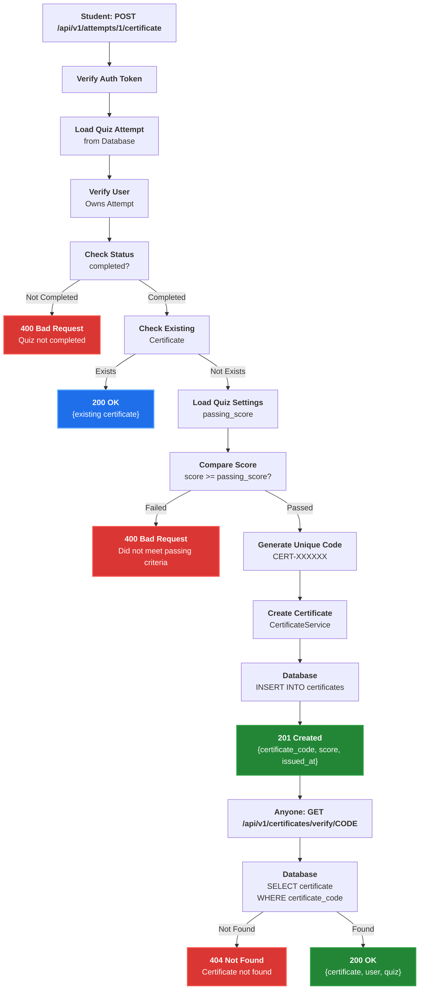
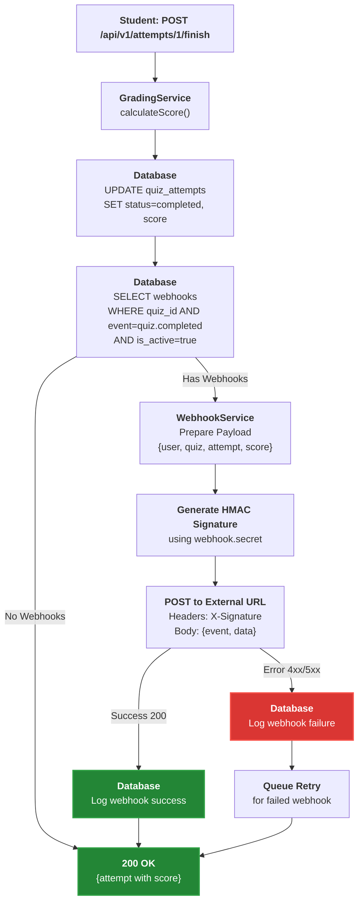

# ProptIQ REST API

A comprehensive, institute-grade online quiz REST API backend built with Laravel. ProptIQ supports quiz authoring, distribution, auto-grading, analytics, and user management.

## Table of Contents

- [System Architecture](#system-architecture)
- [Database Schema](#database-schema)
- [API Endpoints](#api-endpoints)
- [API Flows](#api-flows)
- [Installation](#installation)
- [Configuration](#configuration)
- [Testing](#testing)

## System Architecture


## Database Schema

### Entity Relationship Diagram


### Table Descriptions

#### users
Stores all user accounts with role-based access control.
- **Roles**: admin (full access), teacher (create/manage quizzes), student (take quizzes), guest (limited access)
- **Authentication**: Email/password with bcrypt hashing
- **Relationships**: Creates quizzes, takes attempts, receives certificates, owns/belongs to groups

#### quizzes
Main quiz entity containing metadata and configuration.
- **Status**: draft (editing), published (available), archived (hidden)
- **Type**: classic (standard quiz), exam (formal assessment), survey (no grading)
- **Soft Deletes**: Preserves data when deleted

#### quiz_settings
Configuration for quiz behavior and access control.
- **time_limit**: Duration in minutes (null = unlimited)
- **passing_score**: Minimum score to pass
- **access_mode**: public (anyone), private (groups only), password (requires code)
- **Scheduling**: start_at/end_at for time-bound quizzes

#### questions
Individual questions within a quiz.
- **Types**: mcq, true_false, open, fill_blank, matching, picture, file
- **Points**: Weighted scoring per question
- **Order**: Display sequence (supports shuffling)

#### question_options
Answer choices for MCQ/True-False questions.
- **is_correct**: Marks the correct answer(s)
- **Order**: Display sequence for options

#### quiz_attempts
Tracks student quiz sessions.
- **Status**: in_progress (active), completed (finished), graded (scored)
- **Timing**: start_time and end_time for duration tracking
- **Score**: Calculated after completion

#### question_answers
Individual answers submitted during an attempt.
- **answer_content**: Text answer for open-ended questions
- **option_id**: Selected option for MCQ questions
- **is_correct**: Auto-graded result
- **points_awarded**: Partial credit support

#### certificates
Auto-generated certificates for passing students.
- **certificate_code**: Unique verification code
- **issued_at**: Generation timestamp
- **Verification**: Public endpoint to validate certificates

#### webhooks
Event-driven integrations for external systems.
- **Events**: quiz.started, quiz.completed, etc.
- **Secret**: HMAC signature for security
- **is_active**: Enable/disable without deletion

#### groups
User organization for access control.
- **owner_id**: Teacher/admin who manages the group
- **Many-to-many**: Users can belong to multiple groups
- **Usage**: Private quiz access, class management

## API Endpoints

### Base URL
```
http://127.0.0.1:8000/api/v1
```

### Authentication Endpoints

#### 1. Register User
```http
POST /api/v1/register
Content-Type: application/json

{
  "name": "John Doe",
  "email": "john@example.com",
  "password": "password123",
  "password_confirmation": "password123",
  "role": "student"
}
```

**Response (201 Created):**
```json
{
  "access_token": "1|abc123xyz...",
  "token_type": "Bearer",
  "user": {
    "id": 1,
    "name": "John Doe",
    "email": "john@example.com",
    "role": "student",
    "created_at": "2025-11-25T14:00:00.000000Z",
    "updated_at": "2025-11-25T14:00:00.000000Z"
  }
}
```

#### 2. Login
```http
POST /api/v1/login
Content-Type: application/json

{
  "email": "john@example.com",
  "password": "password123"
}
```

**Response (200 OK):**
```json
{
  "access_token": "2|def456uvw...",
  "token_type": "Bearer",
  "user": {
    "id": 1,
    "name": "John Doe",
    "email": "john@example.com",
    "role": "student"
  }
}
```

**Error Response (401 Unauthorized):**
```json
{
  "message": "Invalid login details"
}
```

#### 3. Logout
```http
POST /api/v1/logout
Authorization: Bearer {token}
```

**Response (200 OK):**
```json
{
  "message": "Logged out successfully"
}
```

#### 4. Get Current User
```http
GET /api/v1/me
Authorization: Bearer {token}
```

**Response (200 OK):**
```json
{
  "id": 1,
  "name": "John Doe",
  "email": "john@example.com",
  "role": "student",
  "created_at": "2025-11-25T14:00:00.000000Z",
  "updated_at": "2025-11-25T14:00:00.000000Z"
}
```

### Quiz Endpoints

#### 5. List Quizzes
```http
GET /api/v1/quizzes
Authorization: Bearer {token}
```

**Access Control:**
- Admin: All quizzes
- Teacher: Own quizzes only
- Student/Guest: Published public quizzes only

**Response (200 OK):**
```json
{
  "data": [
    {
      "id": 1,
      "title": "Mathematics Quiz",
      "description": "Basic algebra quiz",
      "slug": "mathematics-quiz",
      "author_id": 2,
      "status": "published",
      "type": "classic",
      "created_at": "2025-11-25T10:00:00.000000Z",
      "updated_at": "2025-11-25T10:00:00.000000Z",
      "author": {
        "id": 2,
        "name": "Teacher Name"
      }
    }
  ],
  "links": {},
  "meta": {}
}
```

#### 6. Create Quiz
```http
POST /api/v1/quizzes
Authorization: Bearer {token}
Content-Type: application/json

{
  "title": "Mathematics Quiz",
  "description": "Basic algebra quiz",
  "type": "classic",
  "settings": {
    "time_limit": 30,
    "passing_score": 70,
    "access_mode": "public",
    "shuffle_questions": true,
    "show_results": true
  }
}
```

**Response (201 Created):**
```json
{
  "id": 1,
  "title": "Mathematics Quiz",
  "description": "Basic algebra quiz",
  "slug": "mathematics-quiz",
  "author_id": 2,
  "status": "draft",
  "type": "classic",
  "settings": {
    "id": 1,
    "quiz_id": 1,
    "time_limit": 30,
    "passing_score": 70,
    "shuffle_questions": true,
    "show_results": true,
    "access_mode": "public",
    "access_code": null,
    "start_at": null,
    "end_at": null
  }
}
```

#### 7. Get Quiz Details
```http
GET /api/v1/quizzes/{quiz_id}
Authorization: Bearer {token}
```

**Response (200 OK) - For Author/Admin:**
```json
{
  "id": 1,
  "title": "Mathematics Quiz",
  "description": "Basic algebra quiz",
  "status": "published",
  "type": "classic",
  "questions": [
    {
      "id": 1,
      "type": "mcq",
      "content": "What is 2 + 2?",
      "points": 10,
      "order": 1,
      "options": [
        {
          "id": 1,
          "content": "3",
          "is_correct": false,
          "order": 1
        },
        {
          "id": 2,
          "content": "4",
          "is_correct": true,
          "order": 2
        }
      ]
    }
  ],
  "settings": {}
}
```

**Response (200 OK) - For Students:**
```json
{
  "id": 1,
  "title": "Mathematics Quiz",
  "questions": [
    {
      "id": 1,
      "type": "mcq",
      "content": "What is 2 + 2?",
      "options": [
        {
          "id": 1,
          "content": "3",
          "order": 1
        },
        {
          "id": 2,
          "content": "4",
          "order": 2
        }
      ]
    }
  ]
}
```

#### 8. Update Quiz
```http
PUT /api/v1/quizzes/{quiz_id}
Authorization: Bearer {token}
Content-Type: application/json

{
  "title": "Advanced Mathematics Quiz",
  "status": "published",
  "settings": {
    "passing_score": 80
  }
}
```

**Response (200 OK):**
```json
{
  "id": 1,
  "title": "Advanced Mathematics Quiz",
  "status": "published",
  "settings": {
    "passing_score": 80
  }
}
```

#### 9. Delete Quiz
```http
DELETE /api/v1/quizzes/{quiz_id}
Authorization: Bearer {token}
```

**Response (204 No Content)**

### Question Endpoints

#### 10. Add Question to Quiz
```http
POST /api/v1/quizzes/{quiz_id}/questions
Authorization: Bearer {token}
Content-Type: application/json

{
  "type": "mcq",
  "content": "What is 2 + 2?",
  "points": 10,
  "options": [
    {
      "content": "3",
      "is_correct": false
    },
    {
      "content": "4",
      "is_correct": true
    },
    {
      "content": "5",
      "is_correct": false
    }
  ]
}
```

**Response (201 Created):**
```json
{
  "id": 1,
  "quiz_id": 1,
  "type": "mcq",
  "content": "What is 2 + 2?",
  "points": 10,
  "order": 1,
  "options": [
    {
      "id": 1,
      "question_id": 1,
      "content": "3",
      "is_correct": false,
      "order": 1
    },
    {
      "id": 2,
      "question_id": 1,
      "content": "4",
      "is_correct": true,
      "order": 2
    }
  ]
}
```

#### 11. Update Question
```http
PUT /api/v1/questions/{question_id}
Authorization: Bearer {token}
Content-Type: application/json

{
  "content": "What is 3 + 3?",
  "points": 15
}
```

**Response (200 OK):**
```json
{
  "id": 1,
  "content": "What is 3 + 3?",
  "points": 15
}
```

#### 12. Delete Question
```http
DELETE /api/v1/questions/{question_id}
Authorization: Bearer {token}
```

**Response (204 No Content)**

### Quiz Attempt Endpoints

#### 13. Start Quiz Attempt
```http
POST /api/v1/quizzes/{quiz_id}/start
Authorization: Bearer {token}
Content-Type: application/json

{
  "access_code": "optional-password"
}
```

**Response (201 Created):**
```json
{
  "id": 1,
  "quiz_id": 1,
  "user_id": 3,
  "start_time": "2025-11-25T14:00:00.000000Z",
  "end_time": null,
  "score": null,
  "status": "in_progress"
}
```

**Error Responses:**
```json
{
  "message": "Quiz not available"
}
```
```json
{
  "message": "Quiz has not started yet"
}
```
```json
{
  "message": "Quiz has ended"
}
```
```json
{
  "message": "Invalid access code"
}
```

#### 14. Submit Answer
```http
POST /api/v1/attempts/{attempt_id}/submit
Authorization: Bearer {token}
Content-Type: application/json

{
  "question_id": 1,
  "option_id": 2
}
```

**For Open-Ended Questions:**
```json
{
  "question_id": 2,
  "answer_content": "The answer is 42"
}
```

**Response (200 OK):**
```json
{
  "id": 1,
  "attempt_id": 1,
  "question_id": 1,
  "option_id": 2,
  "answer_content": null,
  "is_correct": null,
  "points_awarded": 0
}
```

#### 15. Finish Quiz Attempt
```http
POST /api/v1/attempts/{attempt_id}/finish
Authorization: Bearer {token}
```

**Response (200 OK):**
```json
{
  "id": 1,
  "quiz_id": 1,
  "user_id": 3,
  "start_time": "2025-11-25T14:00:00.000000Z",
  "end_time": "2025-11-25T14:30:00.000000Z",
  "score": 85.50,
  "status": "completed"
}
```

### Analytics Endpoints

#### 16. Get Leaderboard
```http
GET /api/v1/quizzes/{quiz_id}/leaderboard
Authorization: Bearer {token}
```

**Response (200 OK):**
```json
[
  {
    "rank": 1,
    "user": "Alice Johnson",
    "score": 95.00,
    "completed_at": "2025-11-25T14:30:00.000000Z"
  },
  {
    "rank": 2,
    "user": "Bob Smith",
    "score": 85.50,
    "completed_at": "2025-11-25T14:35:00.000000Z"
  }
]
```

#### 17. Get Quiz Statistics
```http
GET /api/v1/quizzes/{quiz_id}/stats
Authorization: Bearer {token}
```

**Access**: Author or Admin only

**Response (200 OK):**
```json
{
  "total_attempts": 50,
  "average_score": 75.50,
  "highest_score": 100.00,
  "lowest_score": 45.00,
  "pass_rate": "80.00%",
  "passing_score": 70
}
```

### Certificate Endpoints

#### 18. Generate Certificate
```http
POST /api/v1/attempts/{attempt_id}/certificate
Authorization: Bearer {token}
```

**Response (201 Created):**
```json
{
  "id": 1,
  "attempt_id": 1,
  "user_id": 3,
  "quiz_id": 1,
  "certificate_code": "CERT-ABC123XYZ",
  "score": 85.50,
  "issued_at": "2025-11-25T14:30:00.000000Z"
}
```

**Error Responses:**
```json
{
  "message": "Quiz not completed"
}
```
```json
{
  "message": "Did not meet passing criteria"
}
```

#### 19. Verify Certificate
```http
GET /api/v1/certificates/verify/{certificate_code}
Authorization: Bearer {token}
```

**Response (200 OK):**
```json
{
  "id": 1,
  "certificate_code": "CERT-ABC123XYZ",
  "score": 85.50,
  "issued_at": "2025-11-25T14:30:00.000000Z",
  "user": {
    "id": 3,
    "name": "John Doe"
  },
  "quiz": {
    "id": 1,
    "title": "Mathematics Quiz"
  }
}
```

### Webhook Endpoints

#### 20. List Webhooks
```http
GET /api/v1/quizzes/{quiz_id}/webhooks
Authorization: Bearer {token}
```

**Response (200 OK):**
```json
[
  {
    "id": 1,
    "quiz_id": 1,
    "event": "quiz.completed",
    "url": "https://example.com/webhook",
    "is_active": true
  }
]
```

#### 21. Create Webhook
```http
POST /api/v1/quizzes/{quiz_id}/webhooks
Authorization: Bearer {token}
Content-Type: application/json

{
  "event": "quiz.completed",
  "url": "https://example.com/webhook",
  "secret": "your-secret-key"
}
```

**Response (201 Created):**
```json
{
  "id": 1,
  "quiz_id": 1,
  "event": "quiz.completed",
  "url": "https://example.com/webhook",
  "secret": "your-secret-key",
  "is_active": true
}
```

#### 22. Delete Webhook
```http
DELETE /api/v1/webhooks/{webhook_id}
Authorization: Bearer {token}
```

**Response (204 No Content)**

### User Management Endpoints (Admin Only)

#### 23. List Users
```http
GET /api/v1/users
Authorization: Bearer {admin_token}
```

**Response (200 OK):**
```json
{
  "data": [
    {
      "id": 1,
      "name": "Admin User",
      "email": "admin@example.com",
      "role": "admin",
      "created_at": "2025-11-25T10:00:00.000000Z"
    }
  ]
}
```

#### 24. Create User
```http
POST /api/v1/users
Authorization: Bearer {admin_token}
Content-Type: application/json

{
  "name": "New Teacher",
  "email": "teacher@example.com",
  "password": "password123",
  "role": "teacher"
}
```

**Response (201 Created)**

#### 25. Get User Details
```http
GET /api/v1/users/{user_id}
Authorization: Bearer {admin_token}
```

**Response (200 OK)**

#### 26. Update User
```http
PUT /api/v1/users/{user_id}
Authorization: Bearer {admin_token}
Content-Type: application/json

{
  "role": "admin"
}
```

**Response (200 OK)**

#### 27. Delete User
```http
DELETE /api/v1/users/{user_id}
Authorization: Bearer {admin_token}
```

**Response (204 No Content)**

## API Flows

### Authentication Flow

```mermaid
graph TB
    subgraph "User Registration"
        RegStart["<b>POST /api/v1/register</b>"] --> RegValidate["<b>Validate Input</b><br/>name, email, password"]
        RegValidate --> RegCreate["<b>Create User</b><br/>Hash Password"]
        RegCreate --> RegDB["<b>Save to Database</b><br/>users table"]
        RegDB --> RegToken["<b>Generate Token</b><br/>Sanctum"]
        RegToken --> RegResponse["<b>201 Created</b><br/>{access_token, user}"]
    end
    
    subgraph "User Login"
        LoginStart["<b>POST /api/v1/login</b>"] --> LoginAuth["<b>Verify Credentials</b><br/>email + password"]
        LoginAuth -->|Valid| LoginToken["<b>Generate Token</b><br/>Sanctum"]
        LoginAuth -->|Invalid| LoginError["<b>401 Unauthorized</b><br/>Invalid login details"]
        LoginToken --> LoginResponse["<b>200 OK</b><br/>{access_token, user}"]
    end
    
    subgraph "Authenticated Request"
        AuthReq["<b>GET /api/v1/me</b><br/>Bearer token"] --> VerifyToken["<b>Verify Token</b><br/>Sanctum Middleware"]
        VerifyToken -->|Valid| GetUser["<b>Fetch User Data</b>"]
        VerifyToken -->|Invalid| AuthError["<b>401 Unauthorized</b>"]
        GetUser --> AuthResponse["<b>200 OK</b><br/>{user}"]
    end
    
    subgraph "Logout"
        LogoutReq["<b>POST /api/v1/logout</b><br/>Bearer token"] --> LogoutVerify["<b>Verify Token</b>"]
        LogoutVerify --> LogoutDelete["<b>Delete Token</b><br/>personal_access_tokens"]
        LogoutDelete --> LogoutResponse["<b>200 OK</b><br/>Logged out successfully"]
    end
    
    style RegResponse fill:#238636,stroke:#2ea043,stroke-width:2px,color:#fff
    style LoginResponse fill:#238636,stroke:#2ea043,stroke-width:2px,color:#fff
    style AuthResponse fill:#238636,stroke:#2ea043,stroke-width:2px,color:#fff
    style LogoutResponse fill:#238636,stroke:#2ea043,stroke-width:2px,color:#fff
    style LoginError fill:#da3633,stroke:#f85149,stroke-width:2px,color:#fff
    style AuthError fill:#da3633,stroke:#f85149,stroke-width:2px,color:#fff
```



### Quiz Creation Flow

```mermaid
graph TB
    Start["<b>Teacher: POST /api/v1/quizzes</b>"] --> Auth["<b>Verify Auth Token</b><br/>Sanctum"]
    Auth --> Validate["<b>Validate Quiz Data</b><br/>title, type, settings"]
    Validate --> CreateQuiz["<b>QuizService</b><br/>Create Quiz"]
    CreateQuiz --> SaveQuiz["<b>Database</b><br/>INSERT INTO quizzes"]
    SaveQuiz --> GenSlug["<b>Generate Unique Slug</b>"]
    GenSlug --> CreateSettings["<b>Create Quiz Settings</b><br/>time_limit, passing_score"]
    CreateSettings --> SaveSettings["<b>Database</b><br/>INSERT INTO quiz_settings"]
    SaveSettings --> QuizResponse["<b>201 Created</b><br/>{quiz, settings}"]
    
    QuizResponse --> AddQ1["<b>Teacher: POST /api/v1/quizzes/1/questions</b>"]
    AddQ1 --> ValidateQ1["<b>Validate Question Data</b><br/>type, content, points"]
    ValidateQ1 --> CreateQ1["<b>Create Question</b>"]
    CreateQ1 --> SaveQ1["<b>Database</b><br/>INSERT INTO questions"]
    SaveQ1 --> CreateOpts["<b>Create Options</b><br/>Loop through options"]
    CreateOpts --> SaveOpts["<b>Database</b><br/>INSERT INTO question_options"]
    SaveOpts --> Q1Response["<b>201 Created</b><br/>{question, options}"]
    
    Q1Response --> AddQ2["<b>Teacher: Add More Questions</b>"]
    AddQ2 --> Q2Response["<b>201 Created</b><br/>{question, options}"]
    
    Q2Response --> Publish["<b>Teacher: PUT /api/v1/quizzes/1</b><br/>status=published"]
    Publish --> AuthCheck["<b>Authorize</b><br/>Owner or Admin"]
    AuthCheck -->|Authorized| UpdateStatus["<b>Database</b><br/>UPDATE quizzes<br/>SET status='published'"]
    AuthCheck -->|Unauthorized| Error403["<b>403 Forbidden</b>"]
    UpdateStatus --> PublishResponse["<b>200 OK</b><br/>{quiz}"]
    
    style QuizResponse fill:#238636,stroke:#2ea043,stroke-width:2px,color:#fff
    style Q1Response fill:#238636,stroke:#2ea043,stroke-width:2px,color:#fff
    style Q2Response fill:#238636,stroke:#2ea043,stroke-width:2px,color:#fff
    style PublishResponse fill:#238636,stroke:#2ea043,stroke-width:2px,color:#fff
    style Error403 fill:#da3633,stroke:#f85149,stroke-width:2px,color:#fff
```



### Quiz Taking Flow

```mermaid
graph TB
    Start["<b>Student: POST /api/v1/quizzes/1/start</b>"] --> Auth["<b>Verify Auth Token</b>"]
    Auth --> LoadQuiz["<b>Load Quiz Data</b><br/>quizzes + quiz_settings"]
    LoadQuiz --> CheckStatus["<b>Check Quiz Status</b><br/>published?"]
    CheckStatus --> CheckDates["<b>Check Dates</b><br/>start_at, end_at"]
    CheckDates --> CheckAccess["<b>Check Access Mode</b><br/>public/private/password"]
    
    CheckAccess -->|Access Denied| Error403["<b>403/404</b><br/>Access Denied"]
    CheckAccess -->|Access Granted| CreateAttempt["<b>Create Quiz Attempt</b><br/>status=in_progress"]
    CreateAttempt --> SaveAttempt["<b>Database</b><br/>INSERT INTO quiz_attempts"]
    SaveAttempt --> StartResponse["<b>201 Created</b><br/>{attempt_id, start_time}"]
    
    StartResponse --> SubmitA1["<b>Student: POST /api/v1/attempts/1/submit</b><br/>question_id, option_id"]
    SubmitA1 --> VerifyAttempt["<b>Verify Ownership</b><br/>& Status"]
    VerifyAttempt --> ValidateQ["<b>Validate Question</b><br/>belongs to quiz"]
    ValidateQ --> SaveAnswer1["<b>Database</b><br/>INSERT/UPDATE question_answers"]
    SaveAnswer1 --> Answer1Response["<b>200 OK</b><br/>{answer}"]
    
    Answer1Response --> SubmitA2["<b>Student: Submit More Answers</b>"]
    SubmitA2 --> SaveAnswer2["<b>Database</b><br/>UPDATE question_answers"]
    SaveAnswer2 --> Answer2Response["<b>200 OK</b>"]
    
    Answer2Response --> Finish["<b>Student: POST /api/v1/attempts/1/finish</b>"]
    Finish --> SetEndTime["<b>Set end_time=now()</b>"]
    SetEndTime --> StartGrading["<b>GradingService</b><br/>calculateScore()"]
    StartGrading --> LoadAnswers["<b>Load All Answers</b><br/>with Questions"]
    LoadAnswers --> CheckCorrect["<b>Check Each Answer</b><br/>is_correct?"]
    CheckCorrect --> CalcPoints["<b>Calculate Points</b><br/>points_awarded"]
    CalcPoints --> UpdateAnswers["<b>Database</b><br/>UPDATE question_answers"]
    UpdateAnswers --> SumScore["<b>Sum Total Score</b>"]
    SumScore --> UpdateAttempt["<b>Database</b><br/>UPDATE quiz_attempts<br/>score, status=completed"]
    UpdateAttempt --> FinishResponse["<b>200 OK</b><br/>{score, status=completed}"]
    
    style StartResponse fill:#238636,stroke:#2ea043,stroke-width:2px,color:#fff
    style Answer1Response fill:#238636,stroke:#2ea043,stroke-width:2px,color:#fff
    style Answer2Response fill:#238636,stroke:#2ea043,stroke-width:2px,color:#fff
    style FinishResponse fill:#238636,stroke:#2ea043,stroke-width:2px,color:#fff
    style Error403 fill:#da3633,stroke:#f85149,stroke-width:2px,color:#fff
```



### Certificate Generation Flow



### Leaderboard & Analytics Flow

```mermaid
graph TB
    subgraph "Leaderboard"
        LB1["<b>User: GET /api/v1/quizzes/1/leaderboard</b>"] --> LB2["<b>Verify Auth Token</b>"]
        LB2 --> LB3["<b>Load Quiz Settings</b><br/>show_results"]
        LB3 -->|Hidden| LB4["<b>403 Forbidden</b><br/>Leaderboard hidden"]
        LB3 -->|Visible| LB5["<b>Database</b><br/>SELECT quiz_attempts<br/>WHERE status=completed<br/>ORDER BY score DESC"]
        LB5 --> LB6["<b>Map Each Attempt</b><br/>user, score, completed_at"]
        LB6 --> LB7["<b>Assign Ranks</b><br/>1, 2, 3..."]
        LB7 --> LB8["<b>200 OK</b><br/>{rank, user, score, completed_at}"]
    end
    
    subgraph "Quiz Statistics"
        ST1["<b>Teacher/Admin: GET /api/v1/quizzes/1/stats</b>"] --> ST2["<b>Verify Auth Token</b>"]
        ST2 --> ST3["<b>Authorize</b><br/>Author or Admin?"]
        ST3 -->|Unauthorized| ST4["<b>403 Forbidden</b><br/>Unauthorized"]
        ST3 -->|Authorized| ST5["<b>Database</b><br/>SELECT quiz_attempts<br/>WHERE status=completed"]
        ST5 --> ST6["<b>Calculate Statistics</b><br/>total, avg, max, min"]
        ST6 --> ST7["<b>Load passing_score</b><br/>from quiz_settings"]
        ST7 --> ST8["<b>Count Passed Attempts</b><br/>score >= passing_score"]
        ST8 --> ST9["<b>Calculate Pass Rate</b><br/>percentage"]
        ST9 --> ST10["<b>200 OK</b><br/>{total_attempts, average_score,<br/>highest_score, lowest_score, pass_rate}"]
    end
    
    style LB8 fill:#238636,stroke:#2ea043,stroke-width:2px,color:#fff
    style ST10 fill:#238636,stroke:#2ea043,stroke-width:2px,color:#fff
    style LB4 fill:#da3633,stroke:#f85149,stroke-width:2px,color:#fff
    style ST4 fill:#da3633,stroke:#f85149,stroke-width:2px,color:#fff
```



### Webhook Flow



### Role-Based Access Control Flow


### Quiz Status Lifecycle


### Quiz Attempt Status Lifecycle


## Installation

### Prerequisites
- PHP 8.1 or higher
- Composer
- MySQL 8.0 or higher
- XAMPP (for local development)

### Step 1: Clone Repository
```bash
git clone https://github.com/EIRSVi/prop-iq.git
cd prop-iq
```

### Step 2: Install Dependencies
```bash
composer install
```

### Step 3: Environment Setup
```bash
cp .env.example .env
php artisan key:generate
```

### Step 4: Configure Database
Edit `.env` file:
```env
DB_CONNECTION=mysql
DB_HOST=127.0.0.1
DB_PORT=3306
DB_DATABASE=proptiq_base
DB_USERNAME=root
DB_PASSWORD=
```

### Step 5: Run Migrations
```bash
php artisan migrate
```

### Step 6: Start Development Server
```bash
php artisan serve
```

The API will be available at `http://127.0.0.1:8000/api/v1`

## Configuration

### Authentication
ProptIQ uses Laravel Sanctum for API token authentication.

```bash
php artisan install:api
```

### Roles
- **Admin** - Full system access
- **Teacher** - Create and manage own quizzes
- **Student** - Take quizzes and view results
- **Guest** - Limited access to public quizzes

### Environment Variables
```env
APP_NAME=ProptIQ
APP_ENV=local
APP_KEY=base64:...
APP_DEBUG=true
APP_URL=http://127.0.0.1:8000

DB_CONNECTION=mysql
DB_HOST=127.0.0.1
DB_PORT=3306
DB_DATABASE=proptiq_base
DB_USERNAME=root
DB_PASSWORD=
```

## Testing

### Using Postman
1. Import `postman-collection.json`
2. The collection includes auto-save scripts for tokens and IDs
3. Follow the testing workflow in `POSTMAN_SETUP.md`

### Manual Testing with cURL
```bash
# Register a teacher
curl -X POST http://127.0.0.1:8000/api/v1/register \
  -H "Content-Type: application/json" \
  -d '{
    "name": "Teacher",
    "email": "teacher@example.com",
    "password": "password123",
    "password_confirmation": "password123",
    "role": "teacher"
  }'
```

### Run Tests
```bash
php artisan test
```

## Error Codes

| Code | Description |
|------|-------------|
| 200 | OK - Request successful |
| 201 | Created - Resource created successfully |
| 204 | No Content - Resource deleted successfully |
| 400 | Bad Request - Invalid input data |
| 401 | Unauthorized - Invalid or missing authentication |
| 403 | Forbidden - Insufficient permissions |
| 404 | Not Found - Resource does not exist |
| 422 | Unprocessable Entity - Validation failed |
| 500 | Internal Server Error - Server-side error |

## Security

- Token-based authentication (Laravel Sanctum)
- Role-based access control (RBAC)
- Password hashing (bcrypt)
- SQL injection protection (Eloquent ORM)
- CSRF protection
- Rate limiting
- Input validation

## Performance

- Database indexing on foreign keys
- Eager loading relationships
- Pagination on list endpoints
- Query optimization
- Caching opportunities (Redis/Memcached)

## Project Statistics

- **27 API Endpoints**
- **13 Database Tables**
- **9 Controllers**
- **4 Services**
- **11 Models**
- **7 Question Types**

## License

This project is licensed under the MIT License.

## Authors

- **EIRSVi** - [GitHub](https://github.com/EIRSVi)

## Support

For issues and questions:
- Create an issue on GitHub
- Review Laravel logs: `storage/logs/laravel.log`

---

Built with Laravel 11.x
